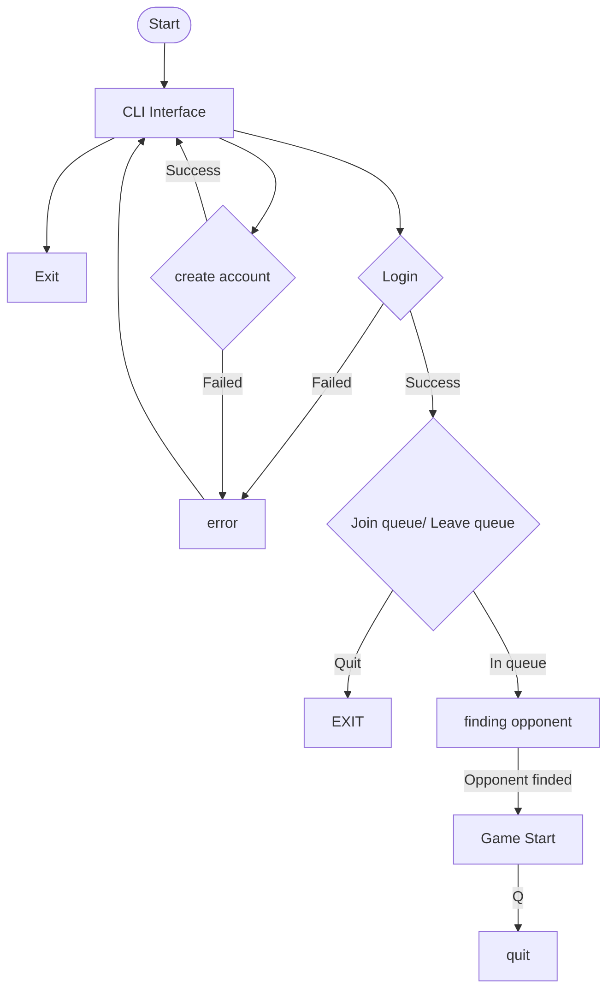

## CLI Readme

Welcome to the CLI documentation,
here is a litle guide to help you use it to have as much fun as possible with it
first to start you must use this command

```bash
  make
```

This will install all the dependencies necessary to be able to compile the CLI.

It will also run the command that launches the CLI program.

Now that this is done on your terminal, you will have an interactive CLI, and you will need to choose with the arrows of your keyboard whether you want to create a new account or log in to an already existing one, or you can leave the CLI.

You can join the queue or leave as you please and again leave if you have enough...

Once you find an opponent after some seconds, you will have a little window that will tell you to press Space to start the game. So you guessed it, the game will not start until you or your opponent presses Space.

You will have two keys to move: W to move upward and S to move downwards. 

You will also have a key to leave the game. It's the Q key.

At the end, after you've played enough and you want to clear some space on your device, you can use this command to delete all the node_modules.

```bash
  make fclean
```

or

```bash
  make clean
```

Here is a little example of how it works.


