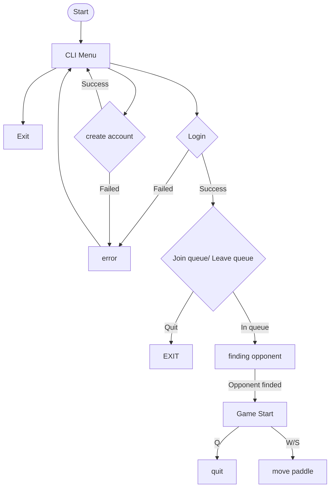

## CLI Readme
Welcome to the CLI documentation,
here is a litle guide to help you use it to have as much fun as possible with it
first to start you must use this command

```bash
  make
```

This will install all the dependencies necessary to be able to compile the CLI. You will also need a .env file that will containt a variable HOST_NAME that will make the requests to the right URL.

It will also run the command that launches the CLI program. This is how it will look like.

<div align="center">
  
</div>
Now that this is done on your terminal, you will have an interactive CLI, and you will need to choose with the arrows of your keyboard whether you want to create a new account or log in to an already existing one, or you can leave the CLI.

After loging in you can join the queue or leave as you please and again leave if you have enough... If everything works fine this is waht you will have on your terminal.
<div align="center">
  
</div>
Once you find an opponent after some seconds, you will have a little window that will tell you to press Space to start the game. So you guessed it, the game will not start until you or your opponent presses Space.

<div align="center">

| Key   | Action             |
| ----- | ------------------ |
| W     | Move Paddle Up     |
| S     | Move Paddle Down   |
| Space | Start Game (Ready) |
| Q     | Quit / Forfeit     |

</div>

At the end, after you've played enough and you want to clear some space on your device, you can use this command to delete all the node_modules.

```bash
  make fclean
```

or

```bash
  make clean
```

Here is a little example of how it works.



Hope you will enjoy the game and the project!
