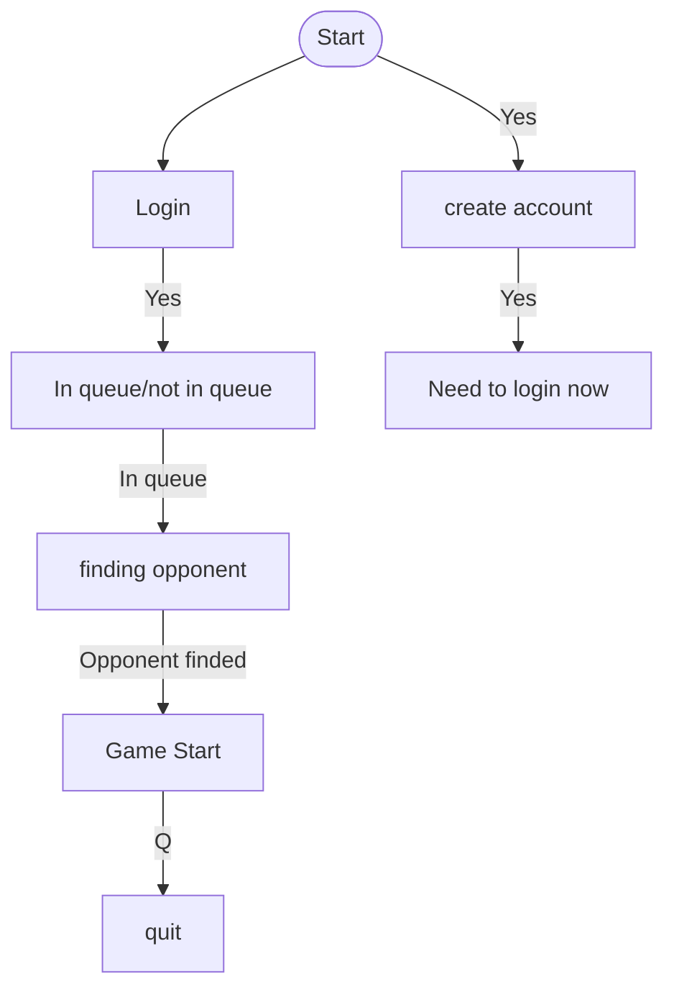

## CLI Readme

Welcome to the CLI documentation,
here is a litle guide to help you use it to have as much fun as possible with it
first to start you must use this command

```bash
  make
```

this will install all the dependencies necessary to be able to compilate the CLI.

It will also run the command that lunches the CLI program.
Now that this is done on your terminal you will have an interactif CLI and you will need to choose with the arrows of your keyboard whether you want to create a new account or login in an already existing one or you can leave the CLI.

After logging to an account you will instantly be in a queue for a game with normal pong and no bonuses :(

You can still leave the queue or join as you please and again leave if you have enought...

Once you find an oppenent after some seconds you will have a little window that will tell you know press Space to lunch the game so you guessed it the game will not start until you or your oppenent presses Space.

you will have two key to move: W to move upward and S to move downwards 

You will also have a key to leave the game. it's the Q key.

At the end after you played enought and you want to clear some space on your device you can use this command

```bash
  make fclean
```

or

```bash
  make clean
```

to delete all the node_modules.

Here is a little example of how it works.


